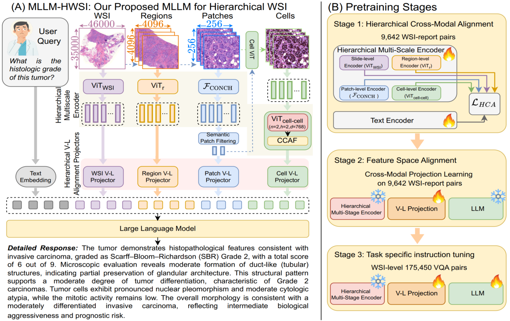

# MLLM-HWSI: A Multimodal Large Language Model for Hierarchical Whole Slide Image Understanding

- Official repository for our paper MLLM-HWSI: A Multimodal Large Language Model for Hierarchical Whole Slide Image Understanding.

<p align="center">
<a href="https://arxiv.org/abs/2603.23067"></a> 
<a href="#mllm-hwsi-chatbot">
</p>

* 

## Model Overview



## Abstract

Whole Slide Images (WSIs) exhibit hierarchical structure,
where diagnostic information emerges from cellular morphology, regional tissue organization, and global context. Existing Computational Pathology (CPath) Multimodal Large Language Models (MLLMs) typically compress an entire WSI into a single embedding, which hinders fine-grained grounding and ignores how pathologists
synthesize evidence across different scales. We introduce
MLLM-HWSI, a Hierarchical WSI-level MLLM that aligns
visual features with pathology language at four distinct
scales, cell as word, patch as phrase, region as sentence,
and WSI as paragraph to support interpretable evidencegrounded reasoning. MLLM-HWSI decomposes each WSI
into multi-scale embeddings with scale-specific projectors
and jointly enforces (i) a hierarchical contrastive objective
and (ii) a cross-scale consistency loss, preserving semantic
coherence from cells to the WSI. We compute diagnostically
relevant patches and aggregate segmented cell embeddings
into a compact cellular token per-patch using a lightweight
Cell–Cell Attention Fusion (CCAF) transformer. The projected multi-scale tokens are fused with text tokens and
fed to an instruction-tuned LLM for open-ended reasoning,
VQA, report, and caption generation tasks. Trained in three
stages, MLLM-HWSI achieves new SOTA results on 13 WSIlevel benchmarks across six CPath tasks. By aligning language with multi-scale visual evidence, MLLM-HWSI provides accurate, interpretable outputs that mirror diagnostic
workflows and advance holistic WSI understanding.

## Environment Setup

1. Clone the repository

```
git clone https://github.com/BasitAlawode/MLLM-HWSI
cd MLLM-HWSI
```

2. Create the python environment

```bash
conda create -y --name mllm_hwsi python==3.10.0
conda activate mllm_hwsi
``` 

3. Install pytorch and torchvision
```bash
pip install torch==2.11.0 torchvision==0.26.0 torchaudio==2.11.0 --index-url https://download.pytorch.org/whl/cu130
```

4. Install other packages

```bash
pip install -r requirements.txt
```

## Data Download

1. Download the train and test set json files from [WSI-LLaVA](https://github.com/XinhengLyu/WSI-LLaVA/tree/main) repository.

2. Download train and test WSI .svs from [here](https://portal.gdc.cancer.gov/projects/TCGA-ACC) and put them in your preferred directory.

Note: Ensure the downloaded WSI slide_ids matches the ones in the json files.

```
├── ./data          # Base data directory
│   ├── trainWSI      # training data folder
|   │   ├── <slide_id_1>.svs      
|   │   ├── <slide_id_2>.svs  
|   │   └── <slide_id_3>.svs
|   |   ...
│   ├── testWSI      # test data folder
|   │   ├── <slide_id_1>.svs      
|   │   ├── <slide_id_2>.svs  
|   │   └── <slide_id_3>.svs
|   |   ...
```

## Data Preparation 
### Hierarchical WSI->Region->Patch->Cell level feature extraction

As our method (MLLM-HWSI) involves region, patches, and cell feature extraction from the WSIs, it is recommended to perform these steps before training or testing. 

NOTE: Steps 1 to 4 below should be performed sequentially.

### 1. Region Extraction

* Region extraction from WSI.

```
python ext_regions.py \
  --source <WSI directory> \
  --save_dir <regions save directory> \
  --seg \
  --patch \
  --stitch
```

### 2. Region and Patch feature extraction

* Patch extraction from regions
* Patch-level feature extraction
* Region-level features extraction
* WSI-level features using Region-level feature aggregation

```
python ext_feats_conch_hierar_par.py \
  --wsi_dir <WSI directory> \
  --reports_path <Report json file path> \
  --h5_dir_4096 <regions save directory>/patches \
  --hipt_repo ./HIPT_4K \
  --checkpoint256 <hipt 256 model.pth path> \
  --checkpoint4k <hipt 4096 model.pth path> \
  --trident_repo ./trident \
  --conch_ckpt_path <conch.bin model path> \
  --out_dir <features save directory> \
  --extract_patch_features \
  --all_gpus \
  --workers_per_gpu 1
```

Note: You may

* download HIPT vit_256_small_dino.pth and vit_4096_xs_dino.pth from [here](https://drive.google.com/drive/folders/1dzOOKTHMPbDh59zPEkOZX5ss6A6Vj9R1?usp=sharing): Source [HIPT](https://github.com/mahmoodlab/HIPT).

* download CONCH checkpoint from [here](https://drive.google.com/drive/folders/1WEF_loFf05FbmUvFo6DUYTYzHKJF4Nym?usp=sharing): Source [CONCH](https://github.com/mahmoodlab/CONCH).

### 3. Cell-level feature extraction

```
python ext_cell_feat_par.py \
  --wsi_dir <Train or Test WSI directory> \
  --region_coords_dir <features save directory>/coords_region4096_valid \
  --selected_indices_dir <features save directory>/patches_filtered \
  --checkpoint <cellvit 256 model.pth path> \
  --output_dir <features save directory>/cells \
  --all_gpus \
  --workers_per_gpu 1 \
  --enforce_amp \
```

Note: You may

* download CellViT CellViT-256-x40-AMP.pth from [here](https://drive.google.com/drive/folders/1dEqwN5NaQ-8oIcc8zDYQo_Q_6VDMS_QU?usp=sharing): Source [CellViT](https://github.com/TIO-IKIM/CellViT).


### 4. (Optional) Save images for visualization

```
python save_patch_images.py \
  --wsi_dir <Train or Test WSI directory> \
  --coords_dir <features save directory>/coords_region4096_valid \
  --indices_dir <features save directory>/patches_filtered \
  --output_dir <features save directory>/sample_images \
  --region_size 4096 \
  --patch_size 256 \
  --max_wsi 2 \
  --max_regions_per_wsi 20 \
  --selection_mode random
```

Note:
 * Other customizations are available in the respective python files. You may tweak them to your particular applications.


## Training

* Ensure that your WSI training data has been prepared as discribed in [Data preparation](#data-preparation) above.

### Stage 1: Hierarchical Multi-Scale Encoders Pre-training

* Please refer to [HIPT](https://github.com/mahmoodlab/HIPT), [CONCH](https://github.com/mahmoodlab/CONCH), and [CellViT](https://github.com/TIO-IKIM/CellViT) for the pretraining of the encoders.

### Stage 2: Training Cross-Modal V-L Projectors

```
python main_train_proj_stage2.py \
  --wsi_dir <Train WSI directory> \
  --report_json <Train report json file path> \
  --wsi_feat_dir <features save directory>/wsi \
  --region_feat_dir <features save directory>/region_4k \
  --patch_feat_dir <features save directory>/patches_filtered \
  --cell_feat_dir <features save directory>/cells \
  --cell_pt_filename encoded_cell_features.pt \
  --save_dir <checkpoint save directory> \
  --save_name vl_projector.pt \
  --model_name Qwen/Qwen2.5-7B-Instruct \
  --device cuda \
  --batch_size 1 \
  --lr 1e-6 \
  --val_ratio 0.1 \
  --num_slide_tokens 64
```

### Stage 3: Task-specific Instruction Tuning

```
python main_train_LLM_stage3.py \
  --wsi_dir <Train WSI directory> \
  --report_json <Train conversation json file path> \
  --wsi_feat_dir <features save directory>/wsi \
  --region_feat_dir <features save directory>/region_4k \
  --patch_feat_dir <features save directory>/patches_filtered \
  --cell_feat_dir <features save directory>/cells \
  --cell_pt_filename encoded_cell_features.pt \
  --stage2_ckpt <stage 2 projector saved path> \
  --save_dir <directory to save huggingFace model> \
  --model_name Qwen/Qwen2.5-7B-Instruct \
  --lora_r 128 \
  --lora_alpha 256 \
  --epochs 50 \
  --batch_size 1 \
  --val_ratio 0.1 \
  --lr 2e-5 \
  --llm_lr 2e-5 \
  --projector_lr 5e-5 \
  --autocast_enabled \
  --save_name <save name.pt>
```

## Inference

* Ensure that your WSI test data has been prepared as discribed in [Data preparation](#data-preparation) above.


### 1 Checkpoints Download

* You may download HLLM-WSI pretrained model from [huggingface](https://huggingface.co/Bastech/MLLM-HWSI).

### 2. Test: Report Generation

```
python main_test_gen.py \
  --wsi_dir <Test WSI directory> \
  --report_json <Test report json file path> \
  --wsi_feat_dir <features save directory>/wsi \
  --region_feat_dir <features save directory>/region_4k \
  --patch_feat_dir <features save directory>/patches_filtered \
  --cell_feat_dir <features save directory>/cells \
  --cell_pt_filename encoded_cell_features.pt \
  --output_json <output json result path> \
  --model_name Bastech/MLLM-HWSI
```

### 3. Test: Visual Question and Answer (VQA)

```
python main_test_vqa.py \
  --wsi_dir <Test WSI directory> \
  --report_json <Test report or conversation json file path> \
  --wsi_feat_dir <features save directory>/wsi \
  --region_feat_dir <features save directory>/region_4k \
  --patch_feat_dir <features save directory>/patches_filtered \
  --cell_feat_dir <features save directory>/cells \
  --cell_pt_filename encoded_cell_features.pt \
  --output_json <output json result path> \
  --model_name Bastech/MLLM-HWSI
  --use_accuracy False
```
* Note: Other customizations are available in the respective python files. You may tweak them to your particular applications.

## MLLM-HWSI ChatBot

You may chat with MLLM-HWSI model using the ChatBot. 

```
python main_vqa_chat.py --port <port_number e.g. 8080>
```

## Acknowledgements

This work acknowledges the authors of the following repositories:

| [WSI-LLaVA](https://github.com/XinhengLyu/WSI-LLaVA) | [CLAM](https://github.com/mahmoodlab/CLAM) | [TRIDENT](https://github.com/mahmoodlab/TRIDENT) | [HIPT](https://github.com/mahmoodlab/HIPT) | [CONCH](https://github.com/mahmoodlab/CONCH) | [CellViT](https://github.com/TIO-IKIM/CellViT) |

## Citation

If you find our work useful in your research, please consider citing:

```

@InProceedings{Alawode_2026_CVPR,
    author    = {Alawode, Basit and Mahmood, Arif and Al Radi, Muaz Khalifa and Albastaki, Shahad and Khan, Asim and Bilal, Muhammad and Abdalla, Moshira Ali and Bennamoun, Mohammed and Javed, Sajid},
    title     = {MLLM-HWSI: A Multimodal Large Language Model for Hierarchical Whole Slide Image Understanding},
    booktitle = {Proceedings of the IEEE/CVF Conference on Computer Vision and Pattern Recognition (CVPR)},
    month     = {June},
    year      = {2026},
    pages     = {13732-13743}
}

@article{alawode2026mllmhwsi,
      title={MLLM-HWSI: A Multimodal Large Language Model for Hierarchical Whole Slide Image Understanding}, 
      author={Basit Alawode and Arif Mahmood and Muaz Khalifa Al-Radi and Shahad Albastaki and Asim Khan and Muhammad Bilal and Moshira Ali Abdalla and Mohammed Bennamoun and Sajid Javed},
      year={2026},
      eprint={2603.23067},
      archivePrefix={arXiv},
      primaryClass={cs.CV},
      url={https://arxiv.org/abs/2603.23067}, 
}
```
