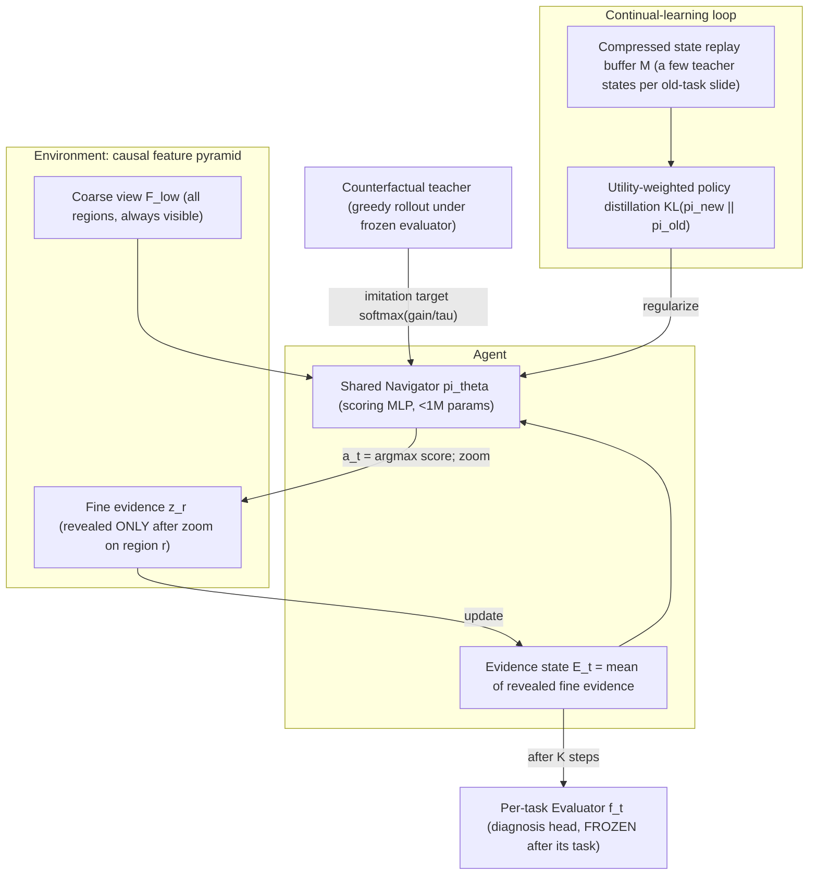

# 系統架構說明（P0）— Continual Learning of Budgeted Visual Evidence Acquisition

> 對應老師要求的四個 P0：**架構圖**、**系統架構 what & why & how**、**如何 Train**、**Loss 定義**。
> 所有元件均已實作於 `nav/engine.py`、`nav/models.py`；本文件描述的就是可執行的系統，不含未實作的構想。
> 正式架構圖：`figures/fig1_architecture.png`（由 `scripts/make_fig1.py` 產生，論文 Fig.1 與投影片共用）。

---

## 0. 一句話定位（CV 方法型）

> 我們研究一個**在觀察預算限制下逐步選擇觀察區域**的 policy（sequential evidence-acquisition policy），
> 在依序學習多個分類任務時的 **catastrophic forgetting**：
> 它與傳統 CL 研究的 prediction forgetting 是可分離的兩件事——我們給出量測 protocol、並提出保存機制。
> WSI 是 benchmark（天然具有 multi-scale 結構與 slide-level 弱監督），**CV methodology 是 contribution**。

抽象後的一般 CV 問題：

| WSI 現象 | 抽象成的 CV 問題 |
|---|---|
| 切片太大、不能全讀 | budgeted observation / active token selection |
| 只有 slide-level label | weakly supervised policy learning |
| 低倍→高倍逐步看 | coarse-to-fine sequential decision under partial observability |
| 任務（癌種）依序到來 | continual learning of a selection policy |

---

## 1. 架構圖



資料流（一張 slide、一個 episode）：

```text
t=0   看到所有 region 的低倍特徵 F_low（[R, d_low]）；E_0 = 0；預算 b_0 = K
t     navigator 對每個未 zoom 候選 r 打分 s_r = pi_theta(F_low[r], E_t, b_t)
      → 選 a_t = argmax s_r → 環境揭露該 region 的高倍證據 z_{a_t}（[d_high]）
      → E_{t+1} = mean(已揭露證據)；b_{t+1} = b_t − 1
t=K   evaluator f(E_K) 輸出診斷；episode 結束
```

**Causal access rule（由環境程式強制）**：未被 zoom 的 region，其高倍證據對 agent「不存在」。
這排除了「先讀全部高倍特徵再排序」的假導航（舊 ZeroNav 被否定的核心原因）。

---

## 2. 元件說明（What / Why / How）

### 2.1 Environment — causal feature pyramid

- **What**：兩層特徵金字塔。低倍層 `F_low ∈ R^{R×d_low}` 全程可見（對應病理醫師的縮圖瀏覽）；
  高倍層 `z_r ∈ R^{d_high}` 只在 region r 被 zoom 後可見。
- **Why**：研究問題是「去哪裡取證」的 policy 遺忘。若 agent 能直接讀取全部高倍特徵，
  問題退化成 feature ranking／MIL attention，policy 就沒有存在的必要。
  部分可觀察（partial observability）是讓 navigation 成為真問題的最低必要條件。
- **How**：`nav/engine.py::evidence_of()` 只聚合 `zoomed` 清單內的高倍向量；
  `rollout_policy()` 每步只把未 zoom 候選交給 navigator。兩個資料集實例化：

| | 低倍（always visible） | 高倍（zoom 後可見） | region 定義 |
|---|---|---|---|
| **pilot40** | HIPT region feature，d_low=192 | 該 region 48 個 CONCH patch 的 mean，d_high=512 | 4096×4096 空間 region（有座標） |
| **can_dataset**（主實驗） | pseudo-region 的 **lossy 摘要**：cluster mean 經固定 random projection 壓到 d_low=64 | cluster 內全部 CONCH patch 的 mean，d_high=512 | patch 特徵 k-means 聚成的 pseudo-region（無座標可用） |

  can_dataset 的低倍摘要刻意做成**低維有損壓縮**（512→64 random projection），
  類比真實 pyramid 中「低倍影像本來就是高倍影像的降採樣」：粗視野資訊量遠小於 zoom 後證據，
  資訊不對稱成立，causal access rule 才有意義。此設計會在論文誠實聲明（pseudo-region、feature-space environment）。

### 2.2 Shared Navigator π_θ

- **What**：一個 scoring MLP（<1M 參數）。輸入 = 候選 region 低倍特徵 ⊕ context（E_t ⊕ 剩餘預算 b_t/K）；
  輸出 = 每個候選一個 logit；policy = softmax over 未 zoom 候選。
- **Why（單一共享，而非 per-task bank）**：per-task navigator bank 的「零遺忘」是結構性的
  （舊參數不更新 + 測試時需要 oracle task ID），不構成 CL 貢獻；
  只有**單一共享 policy** 才會真的發生遺忘，也才需要保存機制——這是研究問題成立的前提。
- **Why（輸入含 E_t 與 b_t）**：選區決策依賴「我已經知道什麼」（避免重複取證）與「還剩幾步」
  （預算緊時要更 aggressive）。消融時可各自拿掉驗證貢獻。
- **How**：`nav/models.py::Navigator`，`Linear(d_low+d_high+1 → 256 → 64 → 1)`。

### 2.3 Evidence state E_t（compressed memory）

- **What**：已揭露高倍證據的 permutation-invariant mean。
- **Why**：第一版刻意用最簡單、可控的壓縮狀態——它同時是 replay buffer 的儲存格式
  （只存低維向量，不存原圖），讓 CL 機制的成本可量化。gated／recurrent memory 留作 ablation 與後續工作。
- **How**：`evidence_of()`；replay state 只保存 `(F_low, candidates, E_t, b_t, teacher gain, utility)`。

### 2.4 Counterfactual teacher（弱監督來源）

- **What**：對每個候選 region 計算「若把它加入證據，凍結 evaluator 的診斷 loss 降多少」：

  $$\mathrm{gain}(r \mid E) = \mathrm{CE}\big(f(E),\,y\big) - \mathrm{CE}\big(f(E \cup \{r\}),\,y\big)$$

  teacher = 逐步取 argmax gain 的 greedy 展開；每步保留完整 gain 分佈作為 soft target。
- **Why**：TCGA 沒有醫師導航軌跡、沒有 region-level 標註（大規模收集不可行）。
  可用的監督只有 slide-level label。counterfactual gain 把它轉換成**每一步的區域效用分佈**，
  這是本方法對「無軌跡監督下學導航」的核心答案；相比 attention weight，
  它直接定義在「加入該證據後診斷是否變好」上，語義與任務對齊。
- **How**：`teacher_rollout()`，向量化計算所有候選的 loss 變化（一次 forward）。

### 2.5 Per-task Evaluator f_t（凍結的歸因設計）

- **What**：小型診斷頭（512→256→64→n_classes）。每個任務訓練完即凍結。
- **Why（navigation-only attribution）**：若 evaluator 與 navigator 一起持續更新，
  舊任務掉分無法歸因（是分類忘了還是導航忘了？）。凍結 evaluator 後，
  舊任務表現的任何變化**只可能來自 navigator 行為改變**——這是我們量測 navigation forgetting 的 protocol 核心。
- **How**：`train_evaluator()` 以 random K-子集證據作 augmentation 訓練；此後只做 inference。

### 2.6 CL 機制（paper-facing method labels）

- **What**：學新任務時，(a) 從每張舊任務訓練 slide 保留 m 個 teacher state（compressed
  counterfactual-teacher replay），(b) 在這些 state 上做 **policy-fidelity
  distillation**：新 policy 對舊 policy 的 KL，
  以該 state 的診斷效用 u(s)=max_r gain(r|E) 加權——診斷價值高的取證行為被優先保護。
- **Why**：要保的不是「分類 logits」而是「取證行為」；且不是所有舊行為都值得保
  （很多 state 的 gain 平坦＝去哪都行），utility weighting 把保存預算集中在真正 task-specific 的決策點上。
  這是對「該保什麼」的方法性回答；`ours` 與 `ours_uniform` 共用
  utility-prioritized buffer truncation，因此消融只 isolate distillation
  loss 的 utility weighting，而非完整 utility-aware memory。
- **How**：`train_navigator(distill=(old_nav, replay_states, λ))`；
  buffer 只存壓縮向量，單一 state < 1 MB，隱私與儲存成本可控（不存 raw WSI）。

---

## 3. 如何 Train（完整流程）

單一任務 t 的訓練分三個 stage（全部在該任務的 training slides 上）：

```text
Stage A  訓練 evaluator f_t：
         隨機抽 K-子集 region 的證據 mean 作輸入（augmentation），CE loss，訓練後凍結。
Stage B  teacher rollout：
         對每張 training slide，在凍結的 f_t 下做 greedy counterfactual 展開，
         得到每步的 (state, gain 分佈, utility)。
Stage C  訓練 navigator π_θ：
         在 teacher states 上以 KL 模仿 softmax(gain/τ)。
```

Continual learning（任務序列 T1 → T2 → … → Tn）：

```text
for t = 1..n:
    Stage A/B/C（Stage C 從上一任務的 θ 繼續訓練 = 共享 navigator）
    if 使用本方法：Stage C 的 loss 加上 replay/distillation 項（見 §4）
    訓練結束：凍結 f_t；保存 π_θ 快照 π_t（僅供評估與 distillation 使用）
    評估：對所有 j ≤ t，用凍結的 f_j 在 T_j test 上跑 π_θ，記錄 acc / Jaccard / drift
```

超參數（protocol 凍結版，詳見 `docs/protocol.md`）：τ=0.05、λ=1.0、
can evaluator 30 epochs（Adam 1e-3, wd 1e-4）、can navigator 10 epochs（Adam 1e-3）；
pilot40 仍為 evaluator 60 / navigator 30、
replay 每張舊 slide 2 個 state。

---

## 4. Loss 定義（逐項說明它在 constrain 什麼）

### 4.1 Evaluator loss（Stage A）

$$\mathcal{L}_{\mathrm{eval}} = \mathrm{CE}\big(f_t(\bar{z}_S),\, y\big),\quad S \sim \text{random }K\text{-subset},\ \ \bar{z}_S = \tfrac{1}{|S|}\sum_{r \in S} z_r$$

- constrain 什麼：讓診斷頭在「任意 K 個 region 的證據」上都能診斷 →
  它對「證據來自哪裡」不敏感，之後凍結時才能公平評估不同導航策略（包含 random baseline）。

### 4.2 Navigator imitation loss（Stage C，主 loss）

$$\mathcal{L}_{\mathrm{nav}} = \mathrm{KL}\Big(\,q^{\mathrm{teacher}}\ \Big\|\ \pi_\theta(\cdot \mid s)\Big),\qquad q^{\mathrm{teacher}}_r = \frac{\exp(\mathrm{gain}(r \mid E)/\tau)}{\sum_{r'} \exp(\mathrm{gain}(r' \mid E)/\tau)}$$

- constrain 什麼：讓 policy 的**整個候選分佈**貼近「反事實診斷效用」分佈，而不是只學 argmax
  （hard label 會壓掉次優但仍有效用的 region，且在效用平坦時製造假確定性）。
  τ 控制 target 的銳利度：τ 小 → 接近 one-hot；τ 大 → 接近 uniform。
- 實作註記：程式中以 `F.kl_div(log_softmax(scores), target)` 計算，即 KL(target‖π) 的形式。

### 4.3 CL loss（本方法，僅在學新任務時啟用）

$$\mathcal{L} = \underbrace{\mathcal{L}_{\mathrm{nav}}^{(\mathrm{new})}}_{\text{學新任務}} \;+\; \lambda \sum_{s \in \mathcal{M}} w(s)\,\underbrace{\mathrm{KL}\Big(\pi_{\theta}(\cdot \mid s)\ \Big\|\ \pi_{\mathrm{old}}(\cdot \mid s)\Big)}_{\text{保舊取證行為}},\qquad w(s) = \frac{u(s)}{\overline{u} + \epsilon}\ \text{（clip 至 } \le 5\text{）}$$

其中 `M` = compressed replay buffer、`u(s) = max_r gain(r|E_s)`（該 state 的診斷效用）、
π_old = 上一任務結束時的 navigator 快照。

- 第一項 constrain：在新任務 teacher 分佈上的模仿（同 4.2）。
- 第二項 constrain：在**舊任務的決策 state** 上，新 policy 的行動分佈不得偏離舊 policy——
  保的是 evidence-selection behavior 本身；utility 權重讓「高診斷價值的決策點」獲得更強保護，
  「怎麼選都行」的 state 幾乎不佔用保存能力。
- λ controls the behavior-fidelity / capability-retention balance; λ→0
  退化為 seqft，較大 λ 傾向保留舊 policy。只有在 own-time new-task
  accuracy 出現下降時，才使用 stability–plasticity 這個更強的名稱。

### 4.4 對照方法的 loss（main table 用）

| 方法 | 額外項 | 儲存 | 定位 |
|---|---|---|---|
| seqft | 無 | 無 | 遺忘下界 baseline |
| EWC | $\lambda \sum_i F_i (\theta_i - \theta^{old}_i)^2$（Fisher 由 L_nav 梯度估計） | Fisher + θ_old | 參數空間正則 baseline |
| LwF-style | KL(π_new‖π_old) 於**新任務** states | 無（rehearsal-free） | 行為正則 baseline |
| replay-only | 舊 teacher states 上重放 $\mathcal{L}_{\mathrm{nav}}$（對舊 gain target） | buffer M | 消融：只有資料重放 |
| distill | 同 4.3 第二項但 w(s)=1 | buffer M | old-policy / policy-fidelity distillation |
| replay | 舊 teacher gain target 重放 | buffer M | counterfactual-teacher replay |
| **ours_uniform** | replay target + policy distillation，w(s)=1 | buffer M | uniform loss-weight reference |
| **ours** | replay target + utility-weighted distill | buffer M | Utility-Weighted Replay Distillation variant |
| joint | 全任務混訓 | 全部 | joint-training reference |

---

## 5. 評估指標（每個 claim 對應的量測）

| 指標 | 定義 | 對應 claim |
|---|---|---|
| ACC / BWT / Forgetting | 標準 CL 指標（balanced accuracy 為底） | 效能層遺忘與緩解 |
| **Selection Jaccard** | 任務 j 學完當下 vs 全序列學完後，π 在 T_j test 每張 slide 所選 region 集合的 Jaccard | **行為層遺忘**（本文核心量測） |
| **Action KL drift** | 固定 probe states 上 KL(π_after‖π_before) | policy 分佈漂移 |
| Selected-region utility | 所選 region 在凍結 f_j 下的平均 counterfactual gain | 選區品質（機制分析） |
| Budget × forgetting 曲線 | K ∈ {1,2,4} 下各指標 | 「冗餘掩蓋遺忘、預算緊才顯形」假說 |

---

## 6. 與相關工作的邊界（一句話版）

- **vs WSI CL（ConSlide 等）**：他們量分類器遺忘；我們把 evidence-acquisition policy 隔離出來量它的遺忘（evaluator 凍結的歸因 protocol 是關鍵差異）。
- **vs WSI navigation（PathAgent / PathNavigate）**：他們做單任務導航；我們研究導航能力在任務序列下的保持。
- **vs VLN（R2R / DUET / HAMT）**：同為離散結構上的 sequential observation policy，但 VLN 有人類示範軌跡與幾何 success 定義；我們無軌跡監督（counterfactual gain 替代）、success 由下游診斷定義。詳見 `docs/vln_survey.md`。
- **vs MLLM-HWSI**：只借它的前處理特徵資產與 hierarchy 概念；不使用其 projector／LLM／QPMIL。
