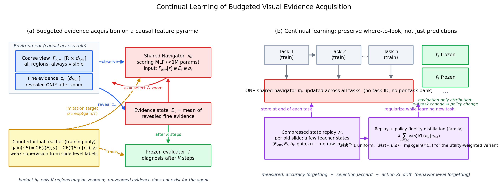

# Remembering Where to Look
## 預算式視覺證據獲取策略的持續學習
### Continual Learning of Budgeted Visual Evidence Acquisition

月會報告（2026-09-09）｜ICASSP 2027 投稿（9/16）
（佔位符 `XX` 於 8/26 圖表凍結後填入）

---

## 1. 問題定位（CV 方法型，WSI 是 benchmark）

- 病理醫師不會全讀 gigapixel 切片：低倍掃視 → zoom 少數區域 → 診斷
- 抽象成一般 CV 問題：**budgeted sequential evidence acquisition**
  - 觀察有成本：policy 在預算 K 內決定「去哪裡看」
  - 只有被選中的證據會進入下游 predictor
- **研究問題**：這個 policy 在任務序列下會不會災難性遺忘？怎麼量？怎麼救？
- 與現有 CL 文獻的差異：他們量 **prediction forgetting**；我們隔離出 **navigation forgetting**（去哪取證的行為遺忘）

---

## 2. 核心觀察（pilot40 → 主實驗動機）

seqft 學完新任務後，回頭看舊任務：

| 量測層 | 指標 | 結果 |
|---|---|---|
| 行為層 | selection Jaccard | 0.79 → **0.061**（選區幾乎全變） |
| 行為層 | action-KL drift | 0.02 → **3.02** |
| 效能層 | accuracy | **幾乎不動** |

**為什麼效能不動？** 切片內訊號冗餘：選錯區域，證據仍「夠好」
→ 遺忘被冗餘**掩蓋**，不是不存在

**假說（主實驗驗證）**：預算越緊（K=1–2）、序列越長（4 任務），
冗餘補償失效 → 行為遺忘轉化為效能遺忘

---

## 3. 系統架構

---

## 4. 環境與歸因 protocol（老師三問的回答）

- **Causal feature pyramid**：低倍摘要全程可見；高倍證據 **zoom 後才存在**
  （堵死「先看全部再排序」的假導航）
- **單一共享 navigator**：不做 per-task bank（結構性零遺忘沒有研究價值）
- **Navigation-only attribution**：每任務 evaluator 訓練完即**凍結**
  → 舊任務掉分**只可能**來自導航行為改變
- **無軌跡監督**：TCGA 沒有醫師 viewing 軌跡
  → **counterfactual diagnostic gain**：gain(r|E) = CE(f(E),y) − CE(f(E∪{r}),y)
  → teacher 分佈 softmax(gain/τ)，navigator 以 KL 模仿

---

## 5. 提出方法：UPD-R

**Utility-weighted Policy Distillation + compressed state Replay**

$$\mathcal{L} = \mathcal{L}_{\text{nav}}^{\text{new}} + \sum_{s\in\mathcal{M}}\Big[\text{KL}(q_s\|\pi_\theta) + \lambda\, w(s)\,\text{KL}(\pi_\theta\|\pi_{\text{old}})\Big]$$

- $\mathcal{M}$：每張舊 slide 存 2 個 teacher state（壓縮特徵 tuple，KB 級，無原圖）
- $w(s) \propto u(s) = \max_r \text{gain}(r|E_s)$：**診斷價值高的決策點被優先保護**
- gain 平坦的 state（去哪都行）幾乎不佔保存能力

---

## 6. 實驗設定（protocol 已凍結）

- **主資料**：can_dataset 4 任務序列 ESCA(150) → LUNG(965) → RCC(888, 3類) → BRCA(952)
  - CONCH 特徵；pseudo-region（k-means, R=32）；粗視野 = 64 維 lossy 投影
  - patient-level split 固定；**兩個任務順序**都跑
- **第二資料**：pilot40 層級環境（HIPT 低倍 / CONCH 高倍，真空間 region）
- K ∈ {1,2,4}；5 seeds；balanced accuracy
- 方法：seqft / EWC / LwF / replay / distill / **UPD-R** / joint 上限
- 指標：AA、Forgetting、BWT ＋ **Jaccard、action-KL、selected utility**（行為層）

---

## 7. Gate 1：導航是可學的（前提檢查）

- learned navigator vs random / spatial-uniform，K ∈ {1,2,4}
- 5 seeds × 5 folds，paired bootstrap 95% CI + Wilcoxon
- 結果：learned − random = **XX [XX, XX]**（K=1）；CI 不跨 0 → PASS
- （圖：figures/gate1_ci.png）

---

## 8. 主結果：冗餘掩蓋 × 預算顯形

| 方法 | AA ↑ | Forg. ↓ | Jaccard ↑ (K=1) |
|---|---|---|---|
| seqft | XX | XX | XX |
| EWC / LwF | XX | XX | XX |
| replay / distill | XX | XX | XX |
| **UPD-R (ours)** | **XX** | **XX** | **XX** |
| joint（上限） | XX | — | — |

- K=4：Jaccard 崩但 accuracy 撐住（**冗餘補償**）
- K=1–2：補償失效，seqft 效能遺忘顯形；UPD-R 恢復 **XX%** gap
- （圖：figures/cl_budget_forgetting_can_main.png）

---

## 9. 機制分析（每個 claim 有直接量測）

1. **冗餘掩蓋的直接證據**：seqft 選區 Jaccard=XX 但 selected utility 仍達教師的 XX%（K=4）；K=1 時 utility 掉到 XX% → 效能遺忘來源
2. **utility weighting 的貢獻**：uniform 權重 → AA −XX、Jaccard −XX
3. **記憶體效率**：512 states/task（<1MB）已飽和
4. **λ 敏感度**：stability–plasticity 平滑 trade-off

---

## 10. VLN survey（老師指定作業）— 結論（31 篇，全部網搜驗證）

**一句話**：VLN 方法棧的三個地基——人類示範軌跡、幾何 success、可重渲染 simulator——
在 WSI 上**一個都不存在**；可搬的是地基之上的**決策結構**（算力不是差異，國網可覆蓋）

- **可借（具體）**：DUET coarse/fine 雙尺度 + global action space（消融證明互補）；
  DAgger/PID on-policy 蒸餾（我們的 frozen evaluator 天生是 queryable oracle，DUET 實證 PID > RL）；
  HAMT history encoding；SPL → accuracy-per-budget
- **不可搬（確定原因）**：
  1. **監督地基**：R2R 每條 instruction 有 GT 軌跡；PathAgentBench 動用 10 位病理醫師只標得 1,822 WSI → 醫師軌跡不可規模化，監督必須改 computed teacher
  2. **Success 性質**：VLN 是幾何、task-agnostic（3m 內），continual 時 reward 不漂移；我們的 success 由 evaluator 按任務定義，**換任務即翻轉** → 我們的 forgetting 成因在 VLN 結構中不存在
  3. **Action 語義**：VLN 是空間位移（觀測免費），WSI zoom 是**資訊揭露**（active perception）→ 角度編碼/方位/最短路徑先驗無對應物
- **Continual VLN 現況**：4 篇（CVLN BMVC 2025 等）全是 scene-domain incremental + GT path replay；
  task-incremental + 弱監督 teacher 漂移 = **無先例**（我們的空缺）

---

## 11. PhD 方向：三步曲（對齊老師三類方向）

1. **本篇（ICASSP 2027）**：feature-space 離散導航的 navigation forgetting
   → 國科會方向 1 的第一個交付
2. **下一篇（+6 個月）**：query-conditioned + dynamic magnification 的
   VLN-style WSI agent（吃 VLN survey；國網算力做 raw-image online encoding）
3. **第三步（+1 年）**：task-free / MLLM-integrated continual agent
   （接回 MLLM-HWSI hierarchy 與 VLM-CL）

同一 benchmark 與 codebase 貫穿；與同學方向互補不撞題

---

## 12. 時程

| 日期 | 里程碑 |
|---|---|
| 8/14–8/16 | P0 文件 + protocol freeze ✅ |
| 8/15–8/23 | 主實驗（4 任務 × 7 方法 × 3K × 5 seeds）🔄 |
| 8/23–8/26 | ablation + 機制分析；**8/26 圖表凍結** |
| 8/27–8/31 | ICASSP 四頁稿 v1 |
| 9/1–9/2 | **稿 + 投影片交老師**（提前一週） |
| 9/9 | 成大月會報告 |
| 9/16 | **ICASSP 2027 投稿** |
